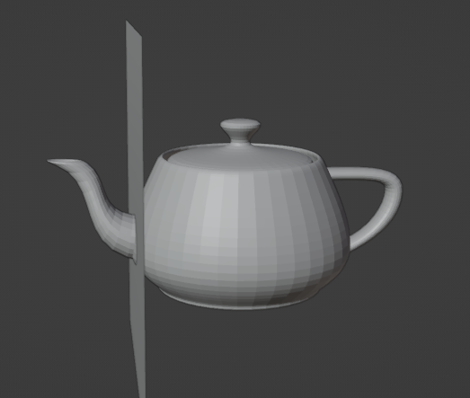
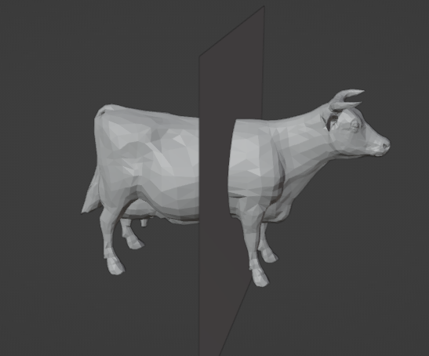

# Fork of [SarahWeiii/CoACD](https://github.com/SarahWeiii/CoACD) with added functionality

## 1. best_cutting_plane(mesh)

Returns the best cutting plane produced by CoACD in the form (a,b,c,d)

|  |  |
| ----------------------------------------------------- | ----------------------------------------------------- |
| (1.0,0.0,0.0,-0.52)                                   | (0.0,1.0,0.0,0.16)                                    |

For visualization use blender script(blender/generate_plane.py). Make sure the mesh is normalized!

## 2. mesh_score(mesh)

Returns how "good" the provided mesh is. The output is the resulting number of convex hulls and their average concavity

Scores for the meshes in the example:

1. Teapot: Convex Hulls=11, avg. concavity=0.007802942425892272
2. Cow: Convex Hulls=28, avg. concavity=0.005786813323796118

## Additional Funtions:

### 1. normalize(mesh) - returns normalized mesh

### 2. clip(mesh,plane) - splits a mesh into two using the plane. Make sure input mesh is normalized!
